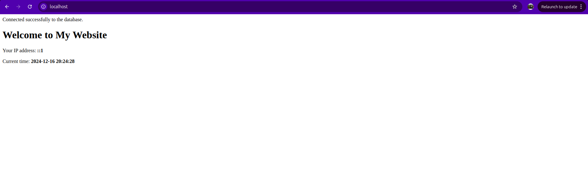
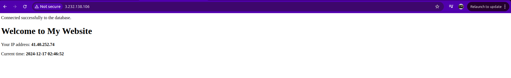

# Web Server and Database Configuration with Ansible
This README covers the process of configuring a web server and database environment using Ansible. The tasks automate the setup of Apache2, MySQL, PHP, and the necessary website files on a server. The configuration is broken down into two parts: one for setting up and testing the environment on a local machine and the second for automating the process using Terraform and Ansible to create a similar environment in the cloud. Third part is explaintion for network basics 

## Project Setup and Deployment (local)
This project demonstrates setting up a web server with Apache, MySQL, PHP, and pushing changes to a Git repository. The following steps outline the process I followed to test the project locally.

### Initialize Git Repository
First, I initialized a Git repository to track the project’s source code.
```sh
git init
git branch -M main
git remote add origin git@github.com:ahmed1958/SE-Intern-Task.git
```
### Install Apache, MySQL, and PHP
To set up a local web server, I installed Apache (for web serving), MySQL (for database management), and PHP (for dynamic content processing).
```sh
sudo apt-get update
sudo apt-get install apache2 mysql-server php libapache2-mod-php php-mysql
systemctl start apache2
sudo cat /etc/apache2/sites-available/000-default.conf  #to ensure that the /var/www/html is the default path
```
### Creating the html file

This is a simple HTML page designed as the homepage for a basic website. It includes a heading welcoming visitors to the website and a brief description indicating that the website is hosted in the /var/www/html/ directory. The structure is minimal, focusing on basic web content display with a title and paragraph. This page serves as the default content for the web server before any dynamic functionality is added.

### replacing html file with php 
```sh
sudo rm /var/www/html/index.html
sudo cp index.php /var/www/html
```

### Secure MySQL Installation
I ran <b>sudo mysql -u root</b> to set up the root password.
then, i use <b>mysql_secure_installation</b> to secure the MySQL installation and removing insecure default settings.

### copy the php files to the default directory
To finalize the configuration, I copied config.php to the web server’s document root, making sure all necessary PHP settings were in place.
<div text-align="center">

</div>

## Project Setup and Deployment (Cloud)

### Infrastructure Setup

#### Terraform Configuration

The infrastructure is defined using Terraform scripts, which include:
  - AWS VPC: A Virtual Private Cloud with two public subnets.
  - EC2 Instance
  - Security Groups: A security group allowing SSH, HTTP.
  - Key Pair: An RSA private key is generated and used for EC2 access.
##### Key components of the Terraform configuration:
  - Public EC2 Instance: The instance is created with public IP and are assigned to the public subnet.
  - Provisioner: A local provisioner is used to dynamically update an inventory file for Ansible after the EC2 instances are created.
##### Variables
Key values used in the Terraform configuration:
##### VPC Configuration:
  - VPC Name: test-vpc
  - VPC CIDR Block: 10.0.0.0/16
  - Public Subnets CIDR: ["10.0.1.0/24"]
  - Availability Zones: ["us-east-1a"]
##### EC2 Configuration:
  - Instance Names: ["my_website"]
  - AMI ID: ami-0e2c8caa4b6378d8c
  - Key Name: private_key
  - Instance Type: t2.micro

##### Initialize and Apply Terraform
Ensure that your AWS credentials are set up, and then run the following Terraform commands:
```sh
cd terraform
terraform init
terraform apply
```
This will provision the infrastructure, including EC2 instances, security groups, and key pairs.

#### Configuration Setup
##### Ansible Playbooks
Once the EC2 instances are provisioned, Ansible is used to configure them.

The config_role performs the following tasks:

1. Update APT Package Cache
Updates the local APT package cache to ensure that the latest available package information is used.

2. Install Apache2, MySQL, PHP, and Required Packages
Installs essential software packages, including Apache2 for the web server, MySQL server for the database, and PHP along with necessary modules to handle PHP files and MySQL connections.

3. Ensure Apache Service is Running and Enabled
Ensures that the Apache2 web server service is running and enabled to start automatically when the system boots.

4. Ensure MySQL Service is Running and Enabled
Ensures that the MySQL database service is running and enabled to start automatically when the system boots.

5. Ensure Website Directory Exists
Verifies that the /var/www/html directory exists on the system, with appropriate permissions, to store the website files.

6. Copy index.php to Website Directory
Copies the index.php file from the local machine to the web server's directory (/var/www/html/) to be served by Apache.

7. Copy config.php to Website Directory
Copies the config.php file from the local machine to the web server's directory (/var/www/html/), enabling the website's configuration settings.

After Terraform completes, the dynamic inventory file will be updated with the IP addresses of the EC2 instances. Run the following Ansible playbook to configure the instances:
```sh
ansible-playbook  my_playbook.yml
```
### accessing the website
<b>to access the ec2 instance visit http://3.232.138.106/ </b>

I can`t created the link instead of the ip because if i use Route53 i will need to domain name and i need money to reserve a domain name but it easy to use Route53 if i have a domain name
### gitignore content

config.php: This file might contain sensitive information, such as database credentials.

terraform/*.tfstate and terraform/*.tfstate.backup: These files contain the state of your Terraform infrastructure. They should not be tracked because they contain sensitive data, such as resource IDs, and could expose private information about your infrastructure.

terraform/crash.log: This file is created when Terraform encounters an error or crash during execution. It’s not necessary to keep this in version control as it’s only useful for debugging purposes and is not part of the project's normal operation.

terraform/*.tfplan: These are the files generated by Terraform when planning infrastructure changes. They are not needed in version control, as they are specific to the state of your environment at a particular point in time and can be regenerated.

terraform/.terraform/: This directory is created by Terraform to store provider plugins and module caches. It is not necessary to track this directory, as it is automatically created and managed by Terraform.

terraform/override.tf, terraform/override.tf.json, terraform/*_override.tf, terraform/*_override.tf.json: These files are used to override the default Terraform configuration. Since they are environment-specific or user-specific, they should not be tracked in version control to avoid conflicts.

terraform/*.tfvars and terraform/*.tfvars.json: These files are used to define variable values for Terraform configurations. They may contain sensitive data such as passwords or secret keys and should not be committed to the repository.

terraform/*.terraform.lock.hcl: This file locks the provider versions used by Terraform to ensure consistency across environments. It can be regenerated and doesn’t need to be tracked in the repository.

terraform/private_key.pem: This is likely a private key used for secure communication with remote machines or services. Private keys should never be tracked in version control for security reasons.

ansible/config_role/files/config.php: Like the earlier config.php file, this file may contain sensitive configuration information for Ansible roles or tasks and should not be tracked in Git.
<div text-align="center">

</div>
## Networking Basics
<b>Ip address</b>: It is used to identify your device and comes in different types. One type is the public IP address, which allows people on the internet to communicate with your device. Another type is the private IP address, which allows devices on the same network to communicate with each other. Currently, there is IPv4, but due to the growing number of devices, the available range is insufficient, leading many companies to adopt IPv6. IP addresses operate at Layer 3, so they can only be used on routers and Layer 3 switches.

<b>MAC address</b>:It is unique to each device and is used by Layer 2 switches to map requests to the correct devices. A MAC address consists of 48 bits, which are used to uniquely identify a device on a local network.

<b>Switches, Routers, and Routing Protocols</b>: 
Switches: A switch is a Layer 2 device used to connect devices within the same network (or local area network, LAN). It operates based on MAC addresses and is responsible for forwarding data frames between devices in the network. Switches use a MAC address table to map the MAC addresses of connected devices and determine where to forward data.

Routers: A router is a Layer 3 device that connects different networks (such as different LANs or a LAN and the internet). It is responsible for forwarding packets between networks based on IP addresses.

Routing Protocols: Routing protocols are used by routers to determine the best path for data to travel across a network. These protocols allow routers to share information about the network topology and adjust routes dynamically. Common routing protocols include:
   - RIP (Routing Information Protocol): A distance-vector protocol that uses hop count as its metric.
   - OSPF (Open Shortest Path First): A link-state protocol that uses a more sophisticated metric based on path cost.

<b>Remote Connection to Cloud Instance</b>: 

In Terraform, they used my AWS credentials and profile to connect to my AWS account and create the infrastructure.
In Ansible, they connected to the machine via the SSH private key that I created during the Terraform step and used it in this step. Note that I also created a public key, which was placed on my machine.
If I want to connect to the machine, I use the private key.


```sh
ssh -i "../terraform/private_key.pem" ubuntu@3.232.138.106
```
